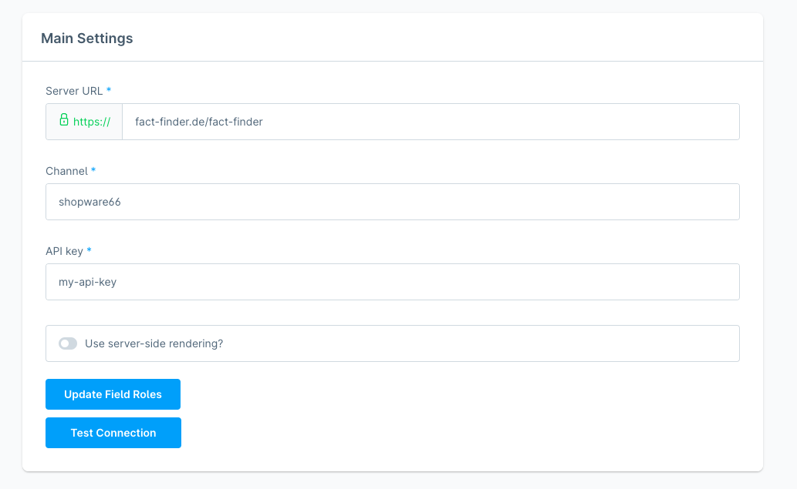
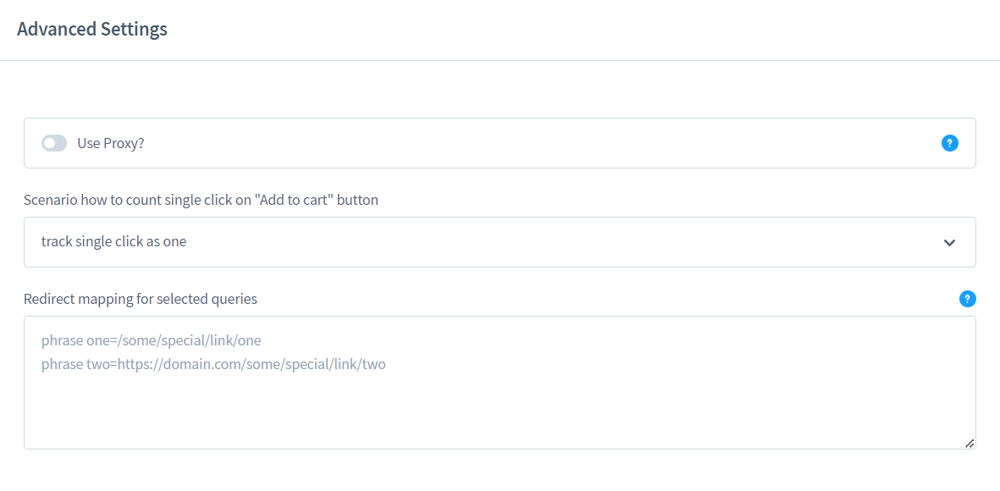
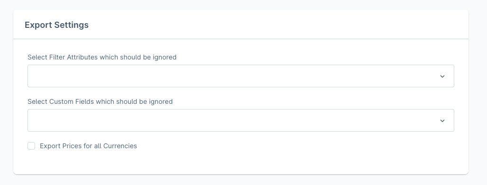
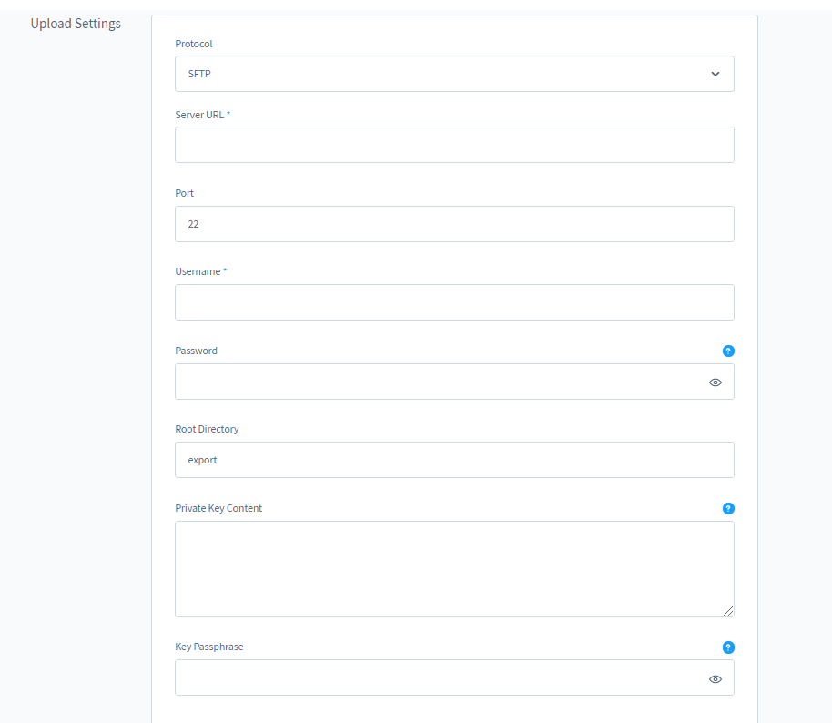
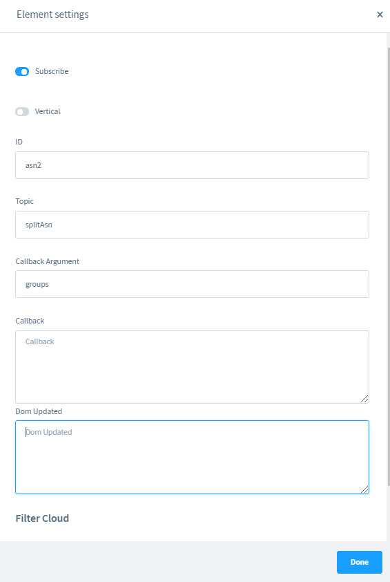

# FACT-Finder® Web Components for Shopware 6

[](https://github.com/FACT-Finder-Web-Components/shopware6-plugin/actions)

This document helps you to integrate the FACT-Finder® Web Components SDK into your Showpare Shop. In addition, it gives
a concise overview of its primary functions. The first chapter *Installation* walks you through the suggested
installation process. The second chapter *Settings* explains the customisation options in the Showpare backend. The
final chapter *Exporting Feed* describes how to use provided console command to export the feed.

- [System Requirements](#system-requirements)
- [FACT-Finder® Supported Sections](#fact-finder-supported-sections)
- [Installation](#installation)
- [Activating the Module](#activating-the-module)
- [Main Settings](#main-settings)
    - [Update Field Roles](#update-field-roles)
- [Export Settings](#export-settings)
    - [Price Columns Format](#price-columns-format)
- [Upload Settings](#upload-settings)
- [Import Settings](#import-settings)
- [Category Pages](#category-pages)
    - [Element Settings](#element-settings)
      - [ASN Element](#asn-element)
      - [Record List Element](#record-list-element)
      - [Campaigns Element](#campaigns-element)
    - [Blocks and Elements Templates](#blocks-and-elements-templates)
    - [Assigning Layout to Category](#assigning-layout-to-category)
- [Exporting Feeds](#exporting-feeds)
    - [CLI](#cli)
    - [Selecting Categories for CMS Export](#selecting-categories-for-cms-export)
    - [Exporting from Admin Panel](#exporting-from-admin-panel)
- [Web Components Integration](#web-components-integration)
    - [Web Components Documentation](#web-components-documentation)
    - [Including Scripts](#including-scripts)
    - [Communication](#communication)
    - [Templates](#templates)
    - [Full List of Implemented Web Components](#full-list-of-implemented-web-components)
- [Modification Examples](#modifications-examples)
    - [Adding New Column to Feed](#adding-new-column-to-feed)
    - [Export Fields Stored in Variants](#export-fields-stored-in-variants)
    - [Creating Custom Entity Export](#creating-custom-entity-export)
        - [Generic Entity Factory](#generic-entity-factory) 
    - [Extending Specific Web Component Template](#extending-specific-web-component-template)
    - [Split ASN on Category Page](#split-asn-on-category-page)
    - [Set custom Field Roles](#set-custom-field-roles)
    - [Adding custom Export Cache Subscriber](#adding-custom-export-cache-subscriber)
    - [Enrich data received from FACT-Finder in ProxyController](#enrich-data-received-from-fact-finder-in-proxycontroller)
- [Contribute](#contribute)
- [License](#license)

## System Requirements

- Shopware 6.4 or higher
- PHP version 7.4 or higher

## FACT-Finder® Supported Sections

Version | Compatibility
------- | --- 
NG      | ✔️ 
7.x     | ❌️

## Installation

To install the plugin, open your terminal and run the command:

    composer require omikron/shopware6-factfinder

After successfully installation, it will be visible in the extensions list. Depending on the Shopware 6 versions
the view could be different.


**Note:**
Plugin can only be installed only via composer, unpacking plugin source code directly into Shopware 6 project directory
will not work as the plugin contains external dependencies which also needs to be installed.

## Activating the Module

To activate the module, please use the switcher located on the left side of the row with extension info.

After it is installed, its configuration is available under the three dots icon.

All sections will be covered in the following paragraphs.

## Main Settings



This section contains a plugin configuration, which is required in order for the module to work. All fields are
self-explained. Configuration set here is used by both Web Components and during the server side communication with
FACT-Finder® instance. Credentials you will be given should be placed here. Please remember that you have to clear the
store cache in order the new applied configuration to start working.

* Server URL - FACT-Finder® instance url   
  **Note:** Server URL should contain a used protocol: (e.g. `https://`) and should end with an
  endpoint ( `fact-finder` )
* Channel - Channel you want to serve data from
* Username
* Password
* API Version - Used FACT-Finder® api version   
  **Note:** Module supports FACT-Finder® api version `v4` and `v5`. By selecting the wrong api version you may cause the Web Components to be unable to communicate with FACT-Finder®

#### Update Field Roles
This functionality offers a way to download field roles configured in FACT-Finder®.
Please use this if you don't use feed offered by the plugin or for some reason you have changed the column names.
You can find more information about what Field Roles are in (Web Components documentation)[https://web-components.fact-finder.de/documentation/4.x/field-roles]
**Note:**
 Updating process is ran for all sales channels, no need to run it separately for each of them

#### Server Side Rendering
That option enables Server Side Rendering (SSR) for `ff-record-list` element on category and search result pages.
That means when user navigate to a page of mentioned type, the HTML output will contain the pre-rendered custom elements.
This is useful especially in terms of SEO because `ff-record-list` renders product data which could have much impact on page rating in browser.
Without SSR enabled, web crawlers could not have a chance to scan the element rendered content because it will not yet be rendered on the time of scanning.

**Note:** More information about SSR concept you can find in the article [Server Side Rendering](https://web-components.fact-finder.de/documentation/4.x/server-side-rendering) from Web Components documentation.

## Advanced Settings



This section contains a plugin configuration, which is optional and provides additional features.

* Use Proxy? - By enabling this, once a search query is sent, it does not immediately reach FACT-Finder, but is handed off to a specific controller
`src/Storefront/Controller/ProxyController.php` which hands the request to the FACT-Finder system, receives the answer, processes it and only then returns it to the frontend view. You can use `EnrichProxyDataEvent` to enrich data received from FACT-Finder. You can find more
  details about implementation [here](#enrich-data-received-from-fact-finder-in-proxycontroller).

    Note: Sending each request to FACT-Finder instance trough Shopware, you lose on performance as each request need to be handled first by HTTP server and then, by Shopware itself. This additional traffic could be easily avoided by not activating this feature if there's no clear reason to use it.
* Scenario how to count single click on "Add to cart" button
* Redirect mapping for selected queries - put each pair `query=url` in separate row. If the phrase appears twice, the first one from the top of the list will be taken. Url can be relative path `/some/page` or absolute url `https://domain.com/some/page?someParameter=1`. If provided pair has an invalid format then it will be ignored.

### Export Settings



* Select Filter Attributes which should be ignored- product properties selected here will not be
  exported. By default, all properties are being exported.
  **Note:** Variant products properties which are part of the configuration will ignore that settings.
* Select Custom Fields which should be ignored - custom fields selected here will not be exported. By
  default, all custom fields are being exported.
* Export prices for all Currencies - if disabled, export will contain only one column `Price`. If enabled, all product
  price will be exported in all currency configured for a given sales channel.
* Enable export cache - if enabled export time will be shorter. Option is connected with `Storefron presentation` - 
  it means that each `Product listing` will be cached. During building cache `FeedPreprocessorEntryBeforeCreate` 
  event is triggered, so you can easily hook to it if you would like to cache some additional data. You can find more 
  details about implementation [here](#adding-custom-export-cache-subscriber).

#### Price Columns Format

If `Export prices in all currencies` setting is set to true, price columns will be exported in followed pattern
`Price_[currency ISO code]` i.e. `Price_De`

### Upload Settings


Following settings are used for uploading already exported feed to a given FTP/SFTP server.

**Note:** The default port setting is 21. If your server is listening on different port, please change it accordingly.

* Protocol
* Server URL
* Port
* Username
* Password
* Root Directory
* Private Key Content
* Passphrase

*Note** Fields "Private Key Content" and "Passphrase" are optional. Use them only if your SFTP server require this method of authentication. 


### Import Settings


* Enable Automatic Import for - define import types which should be triggered. Possible types are: Suggest, Search and
  Recommendation

## Category Pages

**Note:**
This feature is experimental, and it is highly possible that it will be significantly modified in a near future.

Plugin offers a way to use FACT-Finder® Web Components on category pages using page builder Shopping Experiences. There
is two CMS blocks offered:

* Listing
    * ff-record-list
    * ff-asn + including ff-filter-cloud
    * ff-pagination
    * ff-sortbox
* Campaigns
    * ff-campaign-feedbacktext
    * ff-campaign-advisor
    * ff-campaign-redirect
    * ff-campaign-pushed-products


Offered Cms Blocks and Elements are designed to work on pages of type `LandingPage`.
There is a type `CategoryPage` but the builtin validation will not allow saving that prepared page, unless it contains at least one default Product Listing Block.
The block `FACTFinder Web Components Listing` is unfortunately not taken into account.

All elements are available under the category `Commerce`

### Element Settings

Each of the element of given block contains dedicated configuration which allows to configure them without necessity of adding hardcoded values in the templates.


If you do not want to render a specific element, just change the `subscribe` option to `false`. This will make element will not subscribe to the
FACT-Finder® response, hence they will not render any HTML.

#### ASN Element

* Subscribe - Activate element
* Vertical - If set to true, `btn-block` CSS class is added to `ff-asn-group`, and `ff-asn` gets a `align` property set to `vertical
* ID - Element identifier. If left empty, the CMS Element ID will be used.
* Topic - Topic which element is subscribed to. If left empty, the element subscribes to default `asn` topic
* Callback Argument - A name of variable holding FACT-Finder response data appropriate for the element. It will be visible inside Callback scope
* Callback - A function which allows to manipulate the received data. This data is available under the name set in CallbackArgument
* Dom Updated - A listener to `dom-updated` event. This event is triggered when rendered its HTML template

#### Record List Element

* Subscribe - activate element
* Infinity Scrolling - Adds the `inifinity-scrolling` attribute to the `ff-record-list` element 
* Infinite Debounce Delay - adds`infinite-debounce-delay` attribute to the `ff-record-list` element
* ID - Element identifier. If left empty, the CMS Element ID will be used.
* Callback Argument - A name of variable holding FACT-Finder response data appropriate for the element. It will be visibile inside Callback scope
* Callback - A function which allows to manipulate the received data. This data is available under the name set in CallbackArgument
* Dom Updated - A listener to `dom-updated` event. This event is triggered when rendered its HTML template

#### Campaigns Element

* Advisor Campaign - Renders `ff-campaign-advisor` element
* Advisor Campaign Name - Adds `label` attribute to `ff-campaign-advisor`.
* Feedback Campaign - Renders `ff-campaign-feedbacktext` element
* Feedback Campaign Label - Bind the campaign element to a FACT-Finder campaign with a given label, making it reacting only to it.
* Feedback Campaign Flag - Set a flag making the campaign element reacts to FACT-Finder campaign of the specific type
* Feedback Campaign - Renders `ff-campaign-feedbacktext` element
* Advisor Campaign Name - Adds `label` attribute to `ff-campaign-feedbacktext`.
* Redirect Campaign - Renders `ff-campaign-redirect` element
* Pushed Products - Renders `ff-campaign-pushed-products` element
* Pushed Products Flag - Set a flag making the campaign element reacts to FACT-Finder campaign of the specific type

**Note:**
You can find more information about campaigns related elements and their configuration in Web Components [documentation](https://web-components.fact-finder.de/api/4.x/ff-campaign#tab=api)

### Blocks and Elements Templates

Each of the block and element has it own templates which could be found, according to the Shopware 6 convention:

* for blocks - `Resources/views/storefront/block`
* for element - `Resources/views/storefront/element`
  which could be extended using Shopware `sw_extends` tag

### Assigning Layout to Category

Once the page layout is done, you need to assign layout to selected categories.


We strongly recommend not creating many layouts as currently there's still only few possibilities offered anyway.
Future development will bring more blocks and elements will be provided here.

## Exporting Feeds

FACT-Finder allows to export different types of feeds, like a **products**, **cms** and **brands** (or manufacturers)

Also you can define your own data types to export in `services.xml` file in `factfinder.data_export.entity_type_map` parameter

Feed can be exported in two ways: using admin panel (www.yourhost.com/admin#/ui/feed/export/index) or using CLI

#### CLI
Feed export is available in the Shopware CLI application. You can run it by executing:

    php [SHOPWARE_ROOT]/bin/console factfinder:data:export

and follow the instructions in console.

If You want to run command whitout interaction mode, type command with `-n` option:

    php [SHOPWARE_ROOT]/bin/console factfinder:data:export -n

The command can be run with an optional argument indicating the sales channel ID that you are targeting. The ID is an
string value.

    php [SHOPWARE_ROOT]/bin/console factfinder:data:export -n SALES_CHANNEL_ID

If a specific language needs to be specified, theres is a second argument which allows that.

    php [SHOPWARE_ROOT]/bin/console factfinder:data:export -n SALES_CHANNEL_ID LANGUGAGE_ID

There are two additional options (except `-n`):

* `-u` uploads the feed to the configured FTP server after feed is generated.
* `-i` runs the FACT-Finder® import with previously uploaded feed  
  **Note:** This option works only in a combination with `-u`

by default export outputs data in the STDOUT. It could be easily redirected using Linux way of redirecting output.

    php [SHOPWARE_ROOT]/bin/console factfinder:data:export -n > export.csv

#### Selecting Categories for CMS Export
With CMS Export we introduced custom field for CategoryEntity by which we filter the Categories going to be exported.
You can find it on Category edit page. 


#### Exporting from Admin Panel

There is a possibility to run whole integration: generating feed, uploading it to FTP server and trigger FACT-Finder® import.
A dedicated form can be found under `Extensions` section


Select fields allows you to select sales channel and languague parameter for which an integration shall be run.
Select export type gives you possibility to create different content of data available in your Shopware instance.
Export can be done for:
 - Products
 - Brands
 - Cms
 - Category

`Create Export` Send a message to a bus which then might be consumed automatically by an admin worker (if enabled)
or by CLI worker. More information about messaging you can find in official Shopware [documentation](https://developer.shopware.com/docs/guides/hosting/infrastructure/message-queue)


## Web Components Integration

**Note:** Please note that plugin right now is supporting only classic storefronts, rendered using Twig templating
system.

### Web Components Documentation

Full FACT-Finder® Web Components documentation you can find [here](https://web-components.fact-finder.de/api/4.x/ff-communication)


### Including Scripts

The module is shipped with script including FACT-Finder® Web Components.
[Including Scripts](https://web-components.fact-finder.de/documentation/4.x/include-scripts) step is implemented in the
module. No additional action is required.

* Resources/public/ff-web-components/vendor/custom-elements-es5-adapter.js
* Resources/public/ff-web-components/vendor/webcomponents-loader.js
* Resources/public/ff-web-components/ff-web-components/bundle.js

All these files are included in `Resources/views/storefront/layout/meta.html.twig`. That file extends the default
theme [meta.html.twig](https://github.com/shopware/platform/blob/trunk/src/Storefront/Resources/views/storefront/layout/meta.html.twig)
.
**Note:** Including these scripts is obligatory for Web Components to work. Make sure you include it or if your
storefront does not use that file, include all scripts in mentioned order on your own.

### Communication

Main configuration element `ff-communication` is added in file `src/Resources/views/storefront/base.html.twig`
. Same as with `meta.twig.html`, it extends
the [base.html.twig](https://github.com/shopware/platform/blob/trunk/src/Storefront/Resources/views/storefront/base.html.twig)
file defined in default Storefront. This element is populated automatically with the data, configured in module
configuration.

**Note:** If your theme doesn't extend the default Storefront, make sure you implement `ff-communication` element as it
is mandatory and FACT-Finder® Web Components will not work without it.

### Templates

Plugin templates could be found in `Resources/views/storefront/`. Just as with the previous sections, all templates are
extending default Storefront wherever it is possible. You can use these templates if you are extending it
using `sw_extends` which offers a support for a multi inheritance.

### Tracking
Plugin offers a following way of tracking customer actions
 * login - logged automatically via ff-communication element when `user-id` is set
 * click on product - implemented using ff-record template [directives](https://web-components.fact-finder.de/documentation/4.x/tracking-guide) (see Click Tracking)
 * add to cart - implemented in a js [plugin](src/Resources/app/storefront/src/plugin/tracking.plugin.js)
 * purchase - implemented using [ff-checkout-tracking element](https://web-components.fact-finder.de/documentation/4.x/tracking-guide) (see Checkout Tracking)

### Full List of Implemented Web Components
Plugin implements a list of given Web Components:

* Page Header
    * ff-communication
    * ff-searchbox
    * ff-suggest

* Search Result & Navigation Page
    * ff-record-list
    * ff-asn
    * ff-sortbox
    * ff-paging
    * ff-filter-cloud
    * ff-campaign-advisor
    * ff-campaign-feedbacktext
    * ff-campaign-redirect 

* Product Detail Page
    * ff-campaign-product
    * ff-campaign-pushed-products
    * ff-recommendation
    * ff-similar-products

* Checkout Success Page
    * ff-checkout-tracking


## Modifications Examples

### Adding New Column to Feed

The standard feed contains all data FACT-Finder® requires to work. However, you may want to export additional
information which is relevant for your project and not part of a default Shopware installation. This section shows you
how to extend the feed with additional column.

Start with creating field provider - a class
implementing `Omikron\FactFinder\Shopware6\Export\FieldFieldInterface` which will be used to export your data.

```php

use Shopware\Core\Framework\DataAbstractionLayer\Entity;

interface FieldInterface
{
    public function getName(): string;

    public function getValue(Entity $entity): string;
    
    public function getCompatibleEntityTypes(): array;
}
```
The method `getName` contains name of Column under which field should be exported
The method `getValue` contains your field logic and receives the article detail currently being exported.
The method `getCompatibleEntityTypes` contains an array of Shopware Entity classes of which the given field can be applied to

```php

use Shopware\Core\Framework\DataAbstractionLayer\Entity;

class CustomColumn implements FieldInterface
{
     public function getName(): string
     {
        return 'MyColumnName'; // Will be used as column header in the CSV feed
     }

    public function getValue(Entity $entity): string
    {
        // Implement logic to fetch and transform data for a given article detail  
    }
    
    public function getCompatibleEntityTypes(): array
    {
        return [SalesChannelProductEntity::class];
    }
}
```

Once your additional column is defined, register it as a service using Symfony DI (you can find more information
[here][1]) and set them to be [auto-configured][2]. By doing this, your fields will be tagged
as `factfinder.export.field` and can be picked up automatically. Of course, autoconfiguration is
just a convenience we offer, you can still assign the tag to your service manually.

### Export Fields Stored in Variants
By default, only these fields are exported from variants:
    * CustomFields
    * ImageUrl
If your setup requires more field to be exported from variants, you need to tag the desired Field with a `factfinder.export.variant_field` tag in `services.xml file`.

    //src/Resources/config/services.xml:100
    <service id="Omikron\FactFinder\Shopware6\Export\Field\CustomFields">
        <tag name="factfinder.export.variant_field"/>
    </service>

However, exporting data from variants may require additional joins during the data fetch.
To define custom association (join) set them in under a parameter of that name

    //src/Resources/config/services.xml:39
    <parameter key="factfinder.export.associations" type="collection">
        <parameter key="variant_cover">children.cover</parameter>
    </parameter>

All parameters in that collection will be used in a following expression

    $criteria->addAssociation($association);
where `$association` would be a `children.cover` in that example.

**Note:**
Please note that adding more and more associations will have an impact on overall export performance.

### Creating Custom Entity Export
Plugin offers a flexible export mechanism which could be specified to work with different types of entities.
In current state of plugin it allows to export three types of entities:
* SalesChannelProductEntity
* CategoryEntity
* ProductManufacturerEntity

You can extend base with new kinds of entities. In order to do so you need to provide at least three classes
* implementation of the Omikron\FactFinder\Shopware6\Export\ExportInterface which is responsible for exporting shopware entities
* implementation of Omikron\FactFinder\Shopware6\Export\Data\ExportEntityInterface which is a representation Facof shopware entity in an exportable form.
* implementation of Omikron\FactFinder\Shopware6\Export\Data\Factory\FactoryInterface which is responsible for yielding exportable entities mentioned above

#### Generic Entity Factory
If your Entity does not require custom logic in order to be yield (for instance ProductEntityFactory also yields VariantEntities if product is configurable with properties)
You don't need to create new Factory for it. It will be handled by Omikron\FactFinder\Shopware6\Export\Data\Factory\GenericEntityFactory.

**Note:** By entity we consider a class that extends Shopware\Core\Framework\DataAbstractionLayer\Entity class.

If some fields needs more complex logic you can create additional Fields. This is a class that implements Omikron\FactFinder\Shopware6\Export\Field\FieldInterface.
In method getCompatibleEntityTypes you can specify which entities this field could be applied to.
All fields applicable for given entity will be passed in a form of iterator to the instance of Omikron\FactFinder\Shopware6\Export\Data\ExportEntityInterface.
Here is the example (ProductEntity)

    //src/Export/Data/Entity/ProductEntity.php:18
    public function __construct(Product $product, iterable $productFields)
    {
        $this->product       = $product;
        $this->productFields = $productFields;
    }


after that you cann call Omikron\FactFinder\Shopware6\Export\FeedFactory to create a Feed wi
    
    $feed = $this->feedFactory->create($context, YourCustomEntity::class);
    $feed->generate();

**Note:** $context is object of class Shopware\Core\System\SalesChannel\SalesChannelContext

### Extending Specific Web Component Template
All the Web Components rendering HTML, contains it inside the Twig block.
If you need to change it just extend the parent file and override the block which contains the template.
For example if you need to define own template for the ff-record element which is responsible for rendering record tiles on search result page

    

    
        {# here comes the template #}
    

As we see we use `sw_extends` to extend the parent file and then define the re-define `component_factfinder_record` block.
It is contained in the plugin `Resources/views/storefront/components/factfinder/record-list.html.twig` file.
With this code you override only this block and rest of the parent file HTML will be inherited.

**Note:**
Template in that section stands for the HTML rendered by Web Components, not the `.html.twig` file

### Split ASN on Category Page
The demo version of the split ASN approach is available [here](https://search-web-components.fact-finder.de/demos/4.x/ff-asn-split-two-parts/?query=%2a&sid=gQbPAzrjX6VOv1AOI1VQCZwipREXBX).
It is possible to reproduce this functionality with the PageBuilder:

1. Add two FF-ASN CMS Elements 


2. Configure the main ASN


3. Configure the second ASN



**Note:** In that setup, Filter Cloud must be disabled as for now it has no support for custom topics

#### Duplicated filter variants
The example above divides the ASN groups into two exclusive collections.
If you just want to duplicate some filter from the first ASN and put it in the second, just change the configuration of first ASN to be:
")

In that case we  do not use `splice` method but `slice` which does not mutate the original data.

**Note:** Dom Updated listener can be empty. ASN groups from the second ASN are also present in first, so there is no need to merge them together.
**Note:** Since all ASN groups are available in first ASN, the Filter Cloud can be used.
   
### Set custom Field Roles
If you don't plan to use feed offered by the module, or you want some of the essential column to have different name than the default you must remember to adjust the field roles used by the FACT-Finder® and the Web Components.

Default field roles are defined as array of Symfony Configuration Parameters in  `services.xml` file`

    <parameter key="factfinder.field_roles" type="collection">  
     <parameter key="brand">Manufacturer</parameter>  
     <parameter key="deeplink">Deeplink</parameter>  
     <parameter key="description">Description</parameter>  
     <parameter key="ean">EAN</parameter>  
     <parameter key="displayProductNumber">ProductNumber</parameter>  
     <parameter key="imageUrl">ImageUrl</parameter>  
     <parameter key="masterArticleNumber">Master</parameter>  
     <parameter key="price">Price</parameter>  
     <parameter key="productName">Name</parameter>  
     <parameter key="trackingProductNumber">ProductNumber</parameter>  
    </parameter>

In order to override these parameters defined by a module, you have to redefine them in your application `services.xml`. Parameters defined there take precedence over the defaults, defined in the module   

### Adding custom Export Cache Subscriber

```php

use Omikron\FactFinder\Shopware6\Events\FeedPreprocessorEntryBeforeCreate;
use Symfony\Component\EventDispatcher\EventSubscriberInterface;

class FeedPreprocessorEntryBeforeCreateSubscriber implements EventSubscriberInterface
{
    public static function getSubscribedEvents()
    {
        return [FeedPreprocessorEntryBeforeCreate::class => 'onCreateEntries'];
    }

    public function onCreateEntries(FeedPreprocessorEntryBeforeCreate $event)
    {
        $entry = $event->getEntry();
        $entry['additionalCache'] = [
            'some_data' => 'cache1',
            'some_data2' => 'cache2',
        ];
        $event->setEntry($entry);
    }
}

```

### Enrich data received from FACT-Finder in ProxyController

```php

use Omikron\FactFinder\Shopware6\Events\EnrichProxyDataEvent;
use Symfony\Component\EventDispatcher\EventSubscriberInterface;

class EnrichProxyDataEventSubscriber implements EventSubscriberInterface
{
    public static function getSubscribedEvents()
    {
        return [EnrichProxyDataEvent::class => 'enrichData'];
    }

    public function enrichData(EnrichProxyDataEvent $event)
    {
        $data = $event->getData();
        $data['example_data'] = [
            'some_data' => 'data_1',
            'some_data2' => 'data_2',
        ];
        $event->setData($data);
    }
}

```


## Contribute

We welcome contribution! For more information, click [here](.github/CONTRIBUTING.md)

## License

FACT-Finder® Web Components License. For more information see the [LICENSE](LICENSE) file.

[1]: https://developer.shopware.com/docs/guides/plugins/plugins/plugin-fundamentals/dependency-injection

[2]: https://symfony.com/doc/3.3/service_container.html#the-autoconfigure-option

